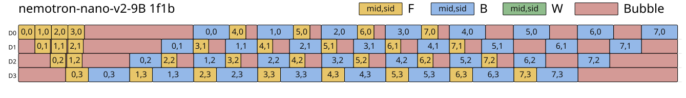
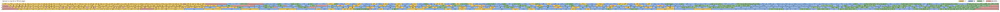

# SimPipe

Pipeline parallelism simulator of OctoPipe (SC26, arXiv version: https://arxiv.org/abs/2509.23722).

## Install

```bash
pip install -e ".[dev]"
```

## Quick start

```bash
simpipe run --config examples/1f1b_custom.yaml --output ./results/1f1b/
simpipe run --config examples/octopipe_auto_tune.yaml --output ./results/octopipe/
```

## OctoPipe Auto-Tune

SimPipe can search pipeline partitions, stage placements, and schedules automatically. Use `schedule: octopipe` and omit `partition_layers` / `placement`, or set `tuning.auto_tune: true`.

```bash
simpipe run --config examples/octopipe_auto_tune.yaml --output ./results/octopipe/
```

The run writes:

- `pipeline_gantt.svg` — per-rank schedule visualization.
- `detailed_info.md` — detailed pipeline statistics.
- `pipeline_config.yaml` — selected partition, placement, schedule records, stage layer pattern, execution time, and memory estimate.

By default, `pipeline_gantt.svg` contains only the schedule plot. Pass `--detailed-gantt` to also render the detailed tables below the chart.

### Examples

<table>
  <tr>
    <th>Gantt</th>
    <th>Detailed Info</th>
  </tr>
  <tr>
    <td valign="top"></td>
    <td valign="top">
      <strong>1F1B</strong>
      <table>
        <tr><th>Start</th><th>End</th></tr>
        <tr><td>0</td><td>133121</td></tr>
      </table>
      <table>
        <tr><th>Device</th><th>Computation</th><th>Bubble</th><th>Warmup</th><th>Residual</th><th>Cooldown</th><th>Total</th></tr>
        <tr><td>D0</td><td>85000 (63.9%)</td><td>48121 (36.1%)</td><td>811</td><td>36036</td><td>11274</td><td>133121 (100%)</td></tr>
        <tr><td>D1</td><td>76160 (57.2%)</td><td>56961 (42.8%)</td><td>4819</td><td>36508</td><td>15634</td><td>133121 (100%)</td></tr>
        <tr><td>D2</td><td>76160 (57.2%)</td><td>56961 (42.8%)</td><td>7923</td><td>28811</td><td>20227</td><td>133121 (100%)</td></tr>
        <tr><td>D3</td><td>103456 (77.7%)</td><td>29665 (22.3%)</td><td>9538</td><td>0</td><td>20127</td><td>133121 (100%)</td></tr>
      </table>
      <table>
        <tr><th>Item</th><th>Value</th></tr>
        <tr><td>Partition</td><td>[14, 14, 14, 14]</td></tr>
        <tr><td>Placement</td><td>[[0], [1], [2], [3]]</td></tr>
      </table>
    </td>
  </tr>
  <tr>
    <td valign="top"></td>
    <td valign="top">
      <strong>OctoPipe</strong>
      <table>
        <tr><th>Start</th><th>End</th></tr>
        <tr><td>0</td><td>89870</td></tr>
      </table>
      <table>
        <tr><th>Device</th><th>Computation</th><th>Bubble</th><th>Warmup</th><th>Residual</th><th>Cooldown</th><th>Total</th></tr>
        <tr><td>D0</td><td>86392 (96.1%)</td><td>3478 (3.9%)</td><td>79</td><td>3399</td><td>0</td><td>89870 (100%)</td></tr>
        <tr><td>D1</td><td>84880 (94.4%)</td><td>4990 (5.6%)</td><td>833</td><td>3313</td><td>844</td><td>89870 (100%)</td></tr>
        <tr><td>D2</td><td>84728 (94.3%)</td><td>5142 (5.7%)</td><td>2423</td><td>1021</td><td>1698</td><td>89870 (100%)</td></tr>
        <tr><td>D3</td><td>84776 (94.3%)</td><td>5094 (5.7%)</td><td>2707</td><td>210</td><td>2177</td><td>89870 (100%)</td></tr>
      </table>
      <table>
        <tr><th>Item</th><th>Value</th></tr>
        <tr><td>Partition</td><td>[2, 2, 2, 2, 2, 2, 2, 3, 2, 3, 2, 3, 2, 3, 3, 2, 3, 3, 2, 2, 2, 3, 3, 1]</td></tr>
        <tr><td>Placement</td><td>[[0, 4, 8, 12, 16, 19, 20], [1, 5, 9, 13, 17, 21], [2, 6, 10, 14, 18, 22], [3, 7, 11, 15, 23]]</td></tr>
      </table>
    </td>
  </tr>
</table>

### Example Config

```yaml
profiled_data: true
time_limit: 20000000

model:
  name: nemotron-nano-v2-9B
  hf_config_path: simpipe/models/hf_configs/NemotronNanoV2-9B.json
  seq_len: 4096
  micro_batch_size: 1
  flash_attention: true

parallel:
  pp_size: 4
  tp_size: 1
  dp_size: 1
  ep_size: 1
  micro_batch_num: 8
  chunk_num: null
  bwd_split: true
  zero_stage: 1
  grad_reduce_in_fp32: true

schedule: octopipe

tuning:
  auto_tune: true
  sim_k: 32
  beam_width: 32
  partition_top_k: 32
  result_top_k: 10
  bubble_overlap_tune: true
  bubble_overlap_max_iter: 4
  bubble_overlap_group_by: mid_type

hardware:
  gpu_peak_tflops: 312.0
  gpu_hbm_gb: 80.0
  comm_alpha_us: 0
```

### Model And Profile Data

Model shape is configured under `model:`. The fields are defined in `simpipe/config/model.py`.

- `name`: model preset name. Built-in presets live in `simpipe/models/registry.py`.
- `hf_config_path`: optional HuggingFace-style JSON config. This fills model shape fields such as `hidden_size`, `num_hidden_layers`, `num_attention_heads`, `vocab_size`, MoE expert counts, and hybrid layer pattern when present.
- `seq_len`, `micro_batch_size`: training shape used for activation and memory estimates.
- `flash_attention`: defaults to `true`; reduces attention saved-activation estimates.

Timing profile data is selected by `profiled_data: true` plus `model.name`.

- Preset layer timings are in `simpipe/models/registry.py`.
- Hybrid model layer patterns use symbols `M` = Mamba, `-` = MLP, `*` = Attention, `T` = dense Transformer layer, and `#` = MoE layer. Quote YAML pattern strings that contain `#`.
- For HF configs with `hybrid_override_pattern`, memory parameter estimates use layer-specific formulas by pattern. Runtime timing still comes from the preset profile keyed by `model.name`.
- To add a new profiled model, add a new entry to `PRESETS` in `simpipe/models/registry.py` with either:
  - `pattern`, `forward_ms`, `backward_ms`, and optional `weight_ms`, or
  - explicit `layer_f_times`, `layer_b_times`, `layer_w_times`.

### Parallel And Training Parameters

Parallel/training fields are under `parallel:` and defined in `simpipe/config/parallel.py`.

- `pp_size`: number of physical pipeline ranks/devices.
- `tp_size`: tensor parallel size. Dense parameters and activations are divided by TP where applicable.
- `dp_size`: data parallel size.
- `ep_size`: expert parallel size. EP only shards expert parameters/states; dense parameters are not divided by EP. `dp_size` must be divisible by `ep_size`.
- `micro_batch_num`: number of pipeline microbatches.
- `chunk_num`: virtual pipeline chunks per physical PP rank. `null` lets OctoPipe search legal chunk counts.
- `bwd_split`: if `true`, backward and weight update workloads are separate.
- `zero_stage`: ZeRO stage. Default is `1`.
- `grad_reduce_in_fp32`: default `true`; gradient buffer memory is FP32. If `false`, gradient memory follows model parameter dtype.

For BF16/FP16 parameters with `grad_reduce_in_fp32: true`, model-state memory is estimated as:

```text
weights:         2X
grad buffer:     4X
fp32 master:     4X
Adam moments:    8X
total:          18X bytes
```

where `X` is the local parameter count after PP/TP/EP sharding and ZeRO rules.

### OctoPipe Tuning Parameters

Tuning fields are under `tuning:` and defined in `simpipe/config/tuning.py`.

- `auto_tune`: enable OctoPipe partition/placement search.
- `partition_top_k`: number of layer partitions retained from the partition-balance search.
- `beam_width`: number of placement candidates generated per chunk/partition.
- `sim_k`: number of top fast-estimated candidates to fully simulate.
- `result_top_k`: number of top candidates printed and stored.
- `bubble_overlap_tune`: enable workload-level bubble-overlap exemption tuning.
- `bubble_overlap_max_iter`: max iterations for bubble-overlap tuning.
- `bubble_overlap_group_by`: grouping key for exemptions: `mid`, `mid_type`, or `mid_sid_type`.

OctoPipe tuning is implemented in `simpipe/tuning/octopipe_tune.py`. Partition search is in `simpipe/tuning/partition_search.py`; placement scoring is in `simpipe/tuning/fast_est.py`.

### Manual Partition And Placement

To disable auto-tune and run a fixed plan, set both:

```yaml
partition_layers: [2, 2, 2, 2]
placement: [[0], [1], [2], [3]]
tuning:
  auto_tune: false
```

For multi-chunk plans, `partition_layers` has one entry per virtual stage, and `placement` maps each physical device to ordered virtual stage ids:

```yaml
parallel:
  pp_size: 4
  chunk_num: 2

partition_layers: [7, 7, 7, 7, 7, 7, 7, 7]
placement: [[0, 4], [1, 5], [2, 6], [3, 7]]
```

### Multimodal Encoders And Decoders

Multimodal front/back modules (vision/audio/text encoders, diffusion decoders, ...) can be attached around the backbone pipeline. Per microbatch, all encoders must finish before backbone stage 0 starts, and the last stage's backward waits for the decoders (the loss sits behind them); encoder backward runs after stage 0's backward. Hops that cross devices pay `hardware.p2p_latency_ms`. Modules of the same kind are independent of each other by default. See `examples/multimodal.yaml`.

On static schedules (everything except OctoPipe), copies that sit on the same device as their boundary stage are spliced into that device's schedule so each microbatch runs `enc F -> bb F -> ... -> dec F -> dec B -> ... -> bb B -> enc B` in strict order: encoder forwards do not run early during warmup, and encoder backwards are not deferred by later backbone forwards. Copies elsewhere (dedicated devices, off-anchor shards of replicated/explicit placements) and all copies under OctoPipe backfill idle slots instead, and only when the work fits before the next backbone entry could start.

An aux module *is* a model: its `model` section is a full backbone-style model config whose timings flow through the same loading pipeline — a `mock_model` with inline per-layer-type times, or any profiled model by name (pattern, layers and times then come from `profiles/`). The module runs as one atomic workload per pass whose F/B/W are the sums over its layers (embedding/head included), and `model.recompute` folds the forward re-run into B exactly like the backbone.

```yaml
encoders:
  - name: vit              # module label; model.name says what it runs
    model:                 # a model config, like the backbone's:
      name: mock_model     # mock_model with inline per-layer-type times (ms),
      num_layers: 4        # or a profiled name (e.g. jamba-20B) whose
      pattern: T*4         # pattern/layers/times load from profiles/
      forward_ms: {T: 0.5} # backward defaults to forward, weight to backward
      backward_ms: {T: 1.0}
      recompute: false     # true: B re-runs F first (B costs F+B); set
    placement: first_stage # act_gb to the checkpointed footprint yourself
    params_gb: 2.0         # parameter tensor size for the memory estimate
    act_gb: 0.3            # one microbatch's activation, F start -> B end
  - name: audio
    forward_ms: 1.5        # flat scalars (module totals per microbatch in ms)
    placement: dedicated   # are shorthand for a single-layer mock model

decoders:
  - name: dit
    forward_ms: 2.0
    placement: last_stage
```

`placement` options:

- `first_stage` / `last_stage` — runs on the device holding the boundary stage. The OctoPipe/BAPAR partition search folds the module's cost into that stage's embedding/head time, so layers rebalance around it.
- `replicated` — one weight copy per backbone device with microbatches sharded round-robin: each microbatch runs its encoder exactly once, on one rank, and up to `pp_size` run in parallel (data parallelism over the module). Weights are paid on every device, compute is split.
- `dedicated` — its own extra device appended after the backbone's, connected via P2P; it shows up as an extra row in the Gantt chart and memory summary.
- `[0, 2]` — explicit device-id list: same round-robin microbatch sharding as `replicated`, restricted to the listed devices.

With a variable batch (`batch.microbatches` / `batch.time_scales`), each module's F/B/W blocks scale linearly with the microbatch's token ratio — the module runs as one opaque block, so the attention-quadratic split only applies inside the backbone's stage timings. The activation charge weighs each resident microbatch the same way.

Encoder activations (`act_gb` per microbatch) live from the module's F until its B completes, which follows the backbone's backward — so an encoder that runs all its forwards upfront holds every microbatch's activation at once. The in-flight throttle only concerns backfilling copies (dedicated devices, off-anchor shards, OctoPipe): `tuning.aux_memory_opt` (default on) searches the smallest per-copy in-flight cap that keeps the makespan unchanged and throttles encoder forwards to it, cutting the activation peak at zero bubble cost (e.g. 16 -> 9 resident microbatches in the example above). `tuning.aux_inflight_limit` overrides the cap explicitly; too-small caps deadlock the static order and the run reports `stalled`. Spliced copies are exempt and skip the search entirely: their forwards already run at the latest useful moment, so their peak is fixed by the schedule shape (1F1B holds about one activation per stage; AFAB legitimately holds all of them through the AF phase). Decoders need no throttle: their F -> B window is naturally short. The memory summary charges `act_gb x peak` to each copy's device.

### Memory Estimation

Memory is estimated after simulation in `simpipe/memory/estimate.py` and stored in `result.memory` plus `pipeline_config.yaml`.

The estimate includes:

- local model weights
- gradient buffer, controlled by `grad_reduce_in_fp32`
- FP32 master weights
- Adam first/second moments
- activation peak from schedule records
- P2P buffers
- FP32 tensor-parallel cross-entropy temporary logits buffer on the head stage

The CLI prints per-rank peak memory and OOM/OK against `hardware.gpu_hbm_gb`.

## Architecture

- `simpipe/graph/` — Operator-level compute graph IR (TensorSpec, Operator, ModelGraph)
- `simpipe/pipeline/` — Partition, placement, scheduling (PP planning)
- `simpipe/core/` — Discrete-event simulation runtime
- `simpipe/comm/` — TP/DP/PP collective communication models
- `simpipe/memory/` — Tensor liveness and ZeRO memory analysis
- `simpipe/tuning/` — Partition/placement search and parameter sweeps
- `simpipe/viz/` — Gantt charts and bubble analysis

## Tests

```bash
pytest
```
